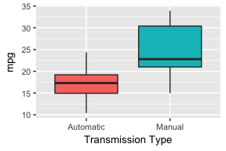
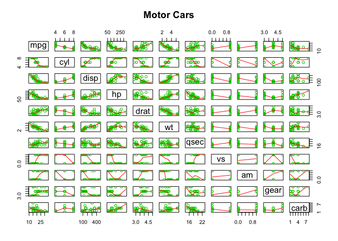
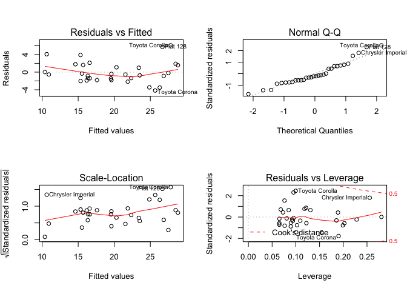
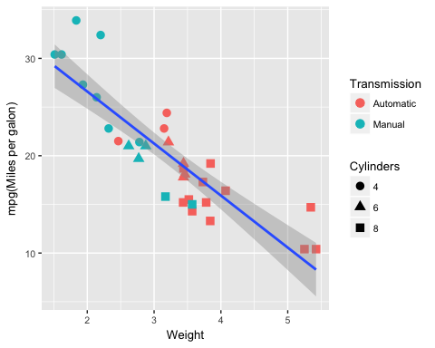

# Coursera Regression Course Project
Steffen Hartleib  
February 16, 2015  

## Executive Summary
The assignemt is to analyze the the mtcar data set to answer the following questions:  
1. Is an automatic or manual transmission better for mpg?  
2. Can we quantify the mpg difference between automatic and manual transmissions? 
&nbsp;

### Conclusion:  
Manual cars get much better gas milage than automatic cars. 7.5 mpg to be exact. That's significant at the 1% level. But the transmission type is not causing this difference in mpg. Weight and number of cylinders are.  Automatic cars tend to be heavier and have more cylinders than manual cars and that's what's causing the higher fuel consumption.    


## Exploratory Analysis
The dataset comprises fuel consumption and 10 aspects of automobile design and performance for 32 automobiles.  
13 of the 32 cars have manual transmissions (Fig 1).  
The models with manual transmission have significantly lower average gas mileage than the models with manual transmission:  

<!-- -->

## Can we quantify the mpg difference between automatic and manual transmissions?
A  simple linear regression model with mpg as the outcome and transmission type (am) as the predictor shows with 1% significance that on average manual models get 7.25 more miles per gallon than automatic models.  
But the R squared shows that only about 36% of the variation in mpg is explained by this model. So yes, this model does quantify the DIFFERNCE in mpg between the two groups. But we need further analysis to determine weither transmission does actually explain the difference, or whether the difference is driven by other factors.


```
##              Estimate Std. Error   t value     Pr(>|t|)
## (Intercept) 17.147368   1.124603 15.247492 1.133983e-15
## amFManual    7.244939   1.764422  4.106127 2.850207e-04
```
 


```
##         R-squared F-statistic      p-value
## Model 1 0.3597989    16.86028 0.0002850207
```
 

## Is automatic or manual transmission better for mpg?

Because transmission type alone doesn't explain the difference in mpg we should add other variables to the model. If the model improves and the transmission coefficient stays significant we'll know that transmission type does impact mpg. And we'll be able to quantify the impact. (Above we only quantified the difference)  But if the Transmission coefficent becomes insignificant we know that transmission type does not impact mpg. At least not accoridng to this data set. Based on Fig. 2 we would expect Weight and Number of Cylinders to have some impact. Let's add them one by one. 

### Model 2: adding weight

```
## lm(formula = mpg ~ am + wt, data = mtcars)
```

```
##                Estimate Std. Error     t value     Pr(>|t|)
## (Intercept) 37.32155131  3.0546385 12.21799285 5.843477e-13
## am          -0.02361522  1.5456453 -0.01527855 9.879146e-01
## wt          -5.35281145  0.7882438 -6.79080719 1.867415e-07
```

```
##         R-squared F-statistic      p-value
## Model 1 0.3597989    16.86028 2.850207e-04
## Model 2 0.7528348    44.16521 1.578762e-09
```
The transmission type (am) is no longer significant. The p value 0.9, which means we reject Null Hypothesis that the coefficent is 0. Weight hoever is highly significant. It decreases mpg by 5.3 Miles per short ton.
Also, the R-squared more than doubled and the F-value is now statistically signficant. This is a much better model. Let's add cylinders next.


### Model 3: adding cylinders


```
## lm(formula = mpg ~ am + wt + cyl, data = mtcars)
```

```
##               Estimate Std. Error    t value     Pr(>|t|)
## (Intercept) 39.4179334  2.6414573 14.9227979 7.424998e-15
## am           0.1764932  1.3044515  0.1353007 8.933421e-01
## wt          -3.1251422  0.9108827 -3.4308942 1.885894e-03
## cyl         -1.5102457  0.4222792 -3.5764148 1.291605e-03
```


```
##         R-squared F-statistic      p-value
## Model 1 0.3597989    16.86028 2.850207e-04
## Model 2 0.7528348    44.16521 1.578762e-09
## Model 3 0.8303383    45.67811 1.578762e-09
```

The Transmission Type coefficient is still insignificant. But the new "No of Cylinders" coefficent is significant at 1%.  And the model improved futher. (F statistic and R squared are up). Now each short ton of weight is reducing mpg by 3.12 miles. Each additional pair of cylinders is reducing mpg by 1.5 miles. So it's the weight and the cylinders, not the transmission that's causing the higher fuel consumption of automatic cars. They're just heavier and have bigger engines. (Fig. 5). Adding additonal variable (hp and displacement) does not improve this model. (Fig. 3)

## Residuals of Model 3

The residuals are aproximately normally distributed. There aren't any ouliers with disproportional influence, and a residual vs. fitted plot doesn't reveal any obvious patters we may have missed. This gives us further confidence in the conclusions we drew from from Model 3. 


## Apendix

### Figure 1: mtcar data summary

```
## 'data.frame':	32 obs. of  11 variables:
##  $ mpg : num  21 21 22.8 21.4 18.7 18.1 14.3 24.4 22.8 19.2 ...
##  $ cyl : num  6 6 4 6 8 6 8 4 4 6 ...
##  $ disp: num  160 160 108 258 360 ...
##  $ hp  : num  110 110 93 110 175 105 245 62 95 123 ...
##  $ drat: num  3.9 3.9 3.85 3.08 3.15 2.76 3.21 3.69 3.92 3.92 ...
##  $ wt  : num  2.62 2.88 2.32 3.21 3.44 ...
##  $ qsec: num  16.5 17 18.6 19.4 17 ...
##  $ vs  : num  0 0 1 1 0 1 0 1 1 1 ...
##  $ am  : num  1 1 1 0 0 0 0 0 0 0 ...
##  $ gear: num  4 4 4 3 3 3 3 4 4 4 ...
##  $ carb: num  4 4 1 1 2 1 4 2 2 4 ...
```

### Figure 2: mtcar
<!-- -->

### Figure 3: Model including displacement + horse power

```
## 
## Call:
## lm(formula = mpg ~ am + wt + cyl + disp + hp, data = mtcars)
## 
## Residuals:
##     Min      1Q  Median      3Q     Max 
## -3.5952 -1.5864 -0.7157  1.2821  5.5725 
## 
## Coefficients:
##             Estimate Std. Error t value Pr(>|t|)    
## (Intercept) 38.20280    3.66910  10.412 9.08e-11 ***
## am           1.55649    1.44054   1.080  0.28984    
## wt          -3.30262    1.13364  -2.913  0.00726 ** 
## cyl         -1.10638    0.67636  -1.636  0.11393    
## disp         0.01226    0.01171   1.047  0.30472    
## hp          -0.02796    0.01392  -2.008  0.05510 .  
## ---
## Signif. codes:  0 '***' 0.001 '**' 0.01 '*' 0.05 '.' 0.1 ' ' 1
## 
## Residual standard error: 2.505 on 26 degrees of freedom
## Multiple R-squared:  0.8551,	Adjusted R-squared:  0.8273 
## F-statistic:  30.7 on 5 and 26 DF,  p-value: 4.029e-10
```

### Figure4: Residual Plot of the linear model weight predicting miles per galon

<!-- -->

### Figure 5: Miles Per Gallon vs. Weight - showing Cylinders and Transmission
<!-- -->


